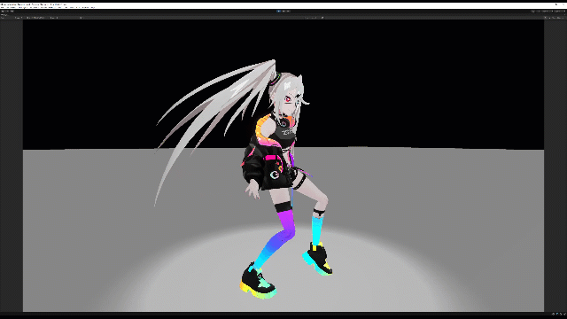
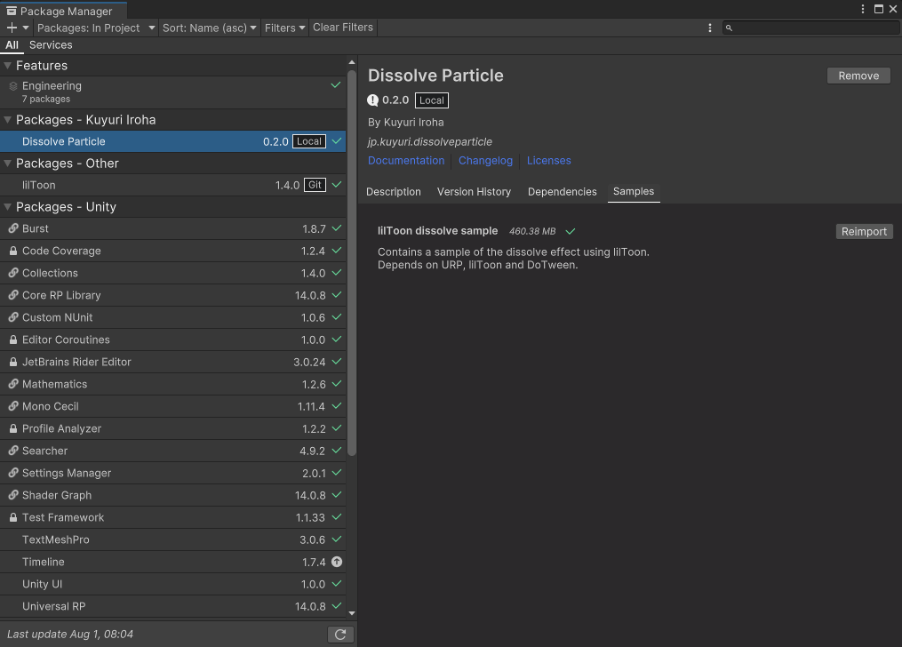
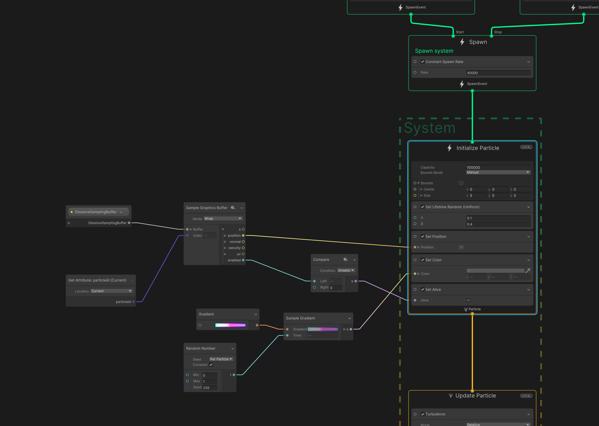
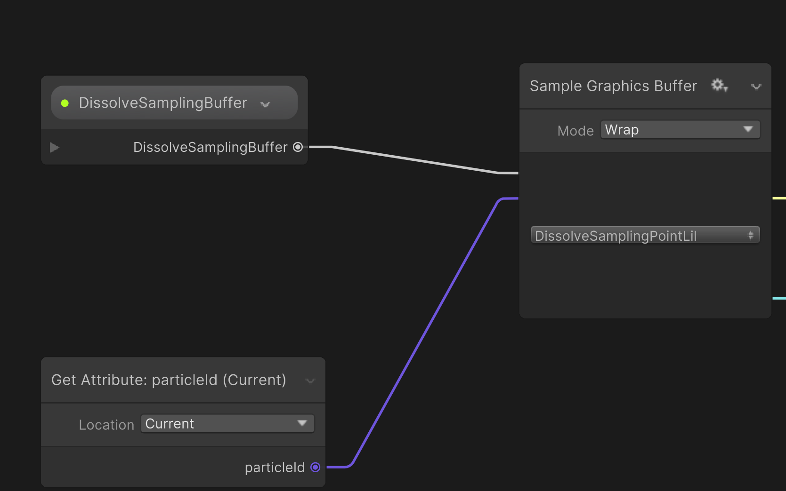
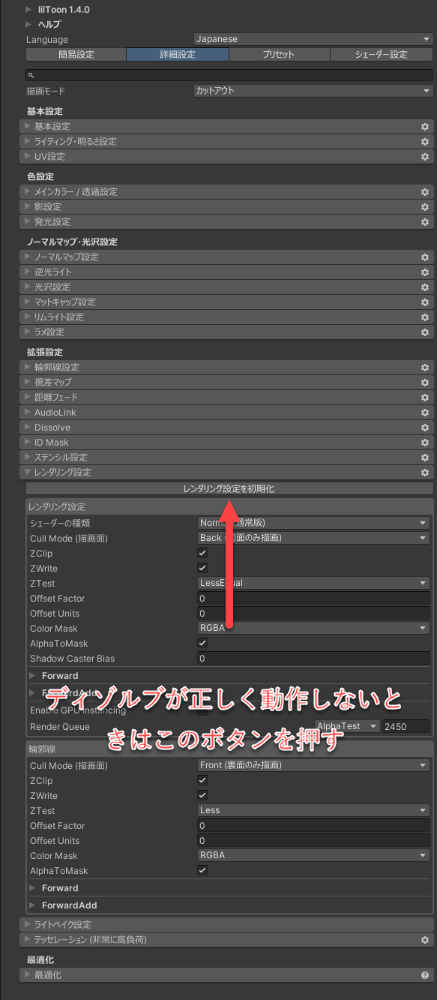

# Dissole Particle

1つのキャラクターについている複数のSkinnedMeshRendererをサンプリングして、VFX Graphで使用可能なGraphicsBufferとして出力する。そしてその結果のディゾルブの境界面に沿うような部分のみにVFX Graphのパーティクルを発火できるようにするGraphicsBufferを出力するもの。

## lilToon版の利用方法

lilToon版はSamplesの中にあり、インポートすると利用できるようになる。

### 動作に必要なもの

- URP (lilToon版動作のために必要)
- DOTween (lilToon版動作のために必要)
- lilToon (lilToon版動作のために必要)
- Timeline (lilToon版動作のために必要)

## Dependencies

Unity 2021.3

### 自動でインポートされるもの

- com.unity.burst: 1.8.4
- com.unity.collections: 1.4.0
- com.unity.mathematics: 1.2.6
- com.unity.visualeffectgraph: 12.1.11

## lilToon版の既知の問題

- ディゾルブ境界をサンプリングする手法としてenabledプロパティによるマスキングを行っている。このため、ディゾルブ境界以外のすべての点もGraphicsBufferに含まれており、VFX Graphから発火させる点をかなり多く設定しないと量が出ない。
- インポート時にVFX GraphのComputeBufferの型情報がうまく読み込まれないためか、型情報が壊れ、リンクが外れてしまう問題が発生する事がある。このため、インポート後に画像のように方とリンクを修正する必要がある。

- lilToonのディゾルブがうまく動作しない場合は、マテリアルのレンダリング初期化ボタンを押すことで解消する場合がある。

# ライセンス表記

© UTJ/UCL